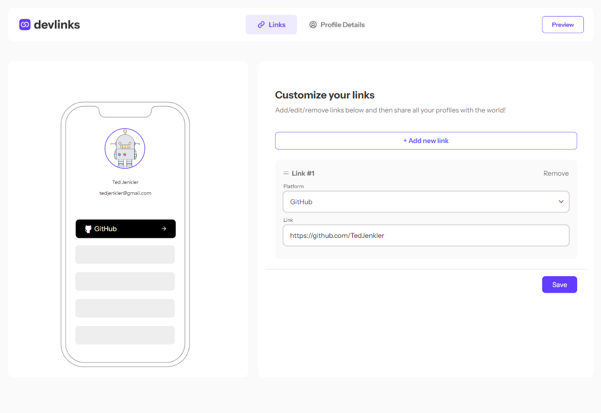

# Frontend Mentor - Link-sharing app solution

This is a solution to the [Link-sharing app challenge on Frontend Mentor](https://www.frontendmentor.io/challenges/linksharing-app-Fbt7yweGsT). Frontend Mentor challenges help you improve your coding skills by building realistic projects.

## Table of contents

- [Overview](#overview)
  - [The challenge](#the-challenge)
  - [Screenshot](#screenshot)
  - [Links](#links)
- [My process](#my-process)
  - [Built with](#built-with)
  - [What I learned](#what-i-learned)
  - [Continued development](#continued-development)
- [Author](#author)
- [Acknowledgments](#acknowledgments)

## Overview

### The challenge

Users should be able to:

- Create, read, update, delete links and see previews in the mobile mockup
- Receive validations if the links form is submitted without a URL.
- Drag and drop links to reorder them
- Add profile details like profile picture, first name, last name, and email
- Receive validations if the profile details form is saved with no first or last name
- Preview their devlinks profile and copy the link to their clipboard
- View the optimal layout for the interface depending on their device's screen size
- See hover and focus states for all interactive elements on the page
- **Bonus**: Save details to a database (build the project as a full-stack app)
- **Bonus**: Create an account and log in (add user authentication to the full-stack app)

### Screenshot

### Links

- Live Site URL: [Linksharing MERN Tailwind](https://linksharing-mern-tailwind.onrender.com/)
- GitHub Repository: [linksharing-MERN-tailwind](https://github.com/TedJenkler/linksharing-MERN-tailwind)

## My process

- Developed the frontend using React with JSX syntax and Tailwind CSS for styling.
- Used Flexbox and a mobile-first approach for responsive design.
- Utilized Vite as the frontend build tool for faster development.
- Implemented Redux Toolkit for efficient state management in the frontend.
- Built the backend using Express.js and set up routes for handling API requests.
- Integrated MongoDB Atlas as the cloud-hosted MongoDB database service for data storage.
- Utilized Mongoose for MongoDB object modeling in the Node.js environment.

## Built with

- Flexbox
- Mobile-first workflow
- [React](https://reactjs.org/) with JSX - JS library
- [Vite](https://vitejs.dev/) - Frontend build tool
- [Tailwind CSS](https://tailwindcss.com/) - For styles
- [Redux Toolkit](https://redux-toolkit.js.org/) - For state management
- [Express](https://expressjs.com/) - Backend framework
- [MongoDB Atlas](https://www.mongodb.com/cloud/atlas) - Cloud-hosted MongoDB database service
- [Mongoose](https://mongoosejs.com/) - MongoDB object modeling for Node.js

### What I learned

I learned how to improve my ability to search on the internet for solutions to error codes, especially during the deployment of the site. I also improved my knowledge of the MERN stack and how it works with Redux.

### Continued development

In the future, I plan to:

- Update the styling to achieve more pixel-perfect and responsive design.
- Optimize the code for better performance and readability.

## Author

- Website - [Teodor Jenkler](https://www.linkedin.com/in/tedjenklerwebdeveloper/)
- Frontend Mentor - [@TedJenkler](https://www.frontendmentor.io/profile/TedJenkler)

## Acknowledgments

- Used resources from [Dev.to](https://dev.to/), [Stack Overflow](https://stackoverflow.com/), and ChatGPT for solving various coding challenges.
